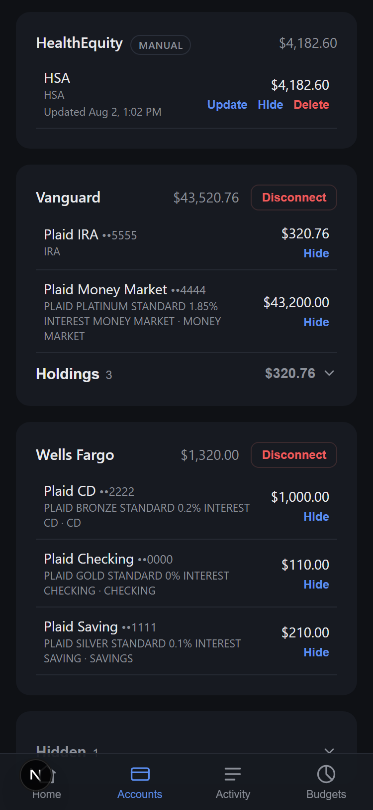
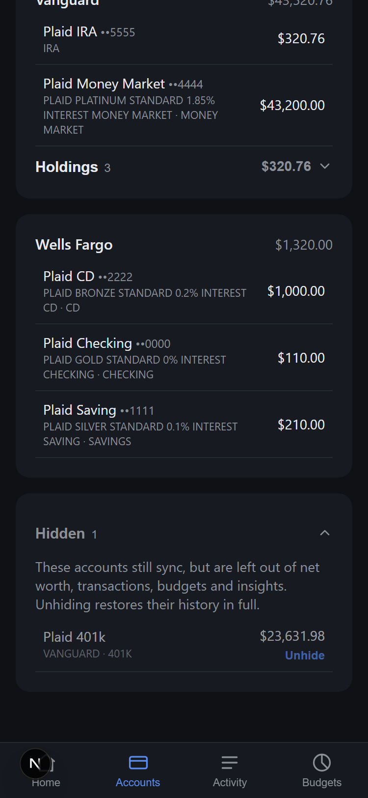
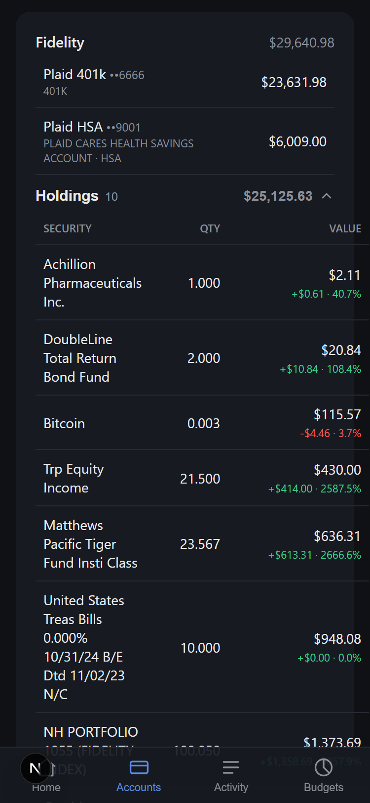
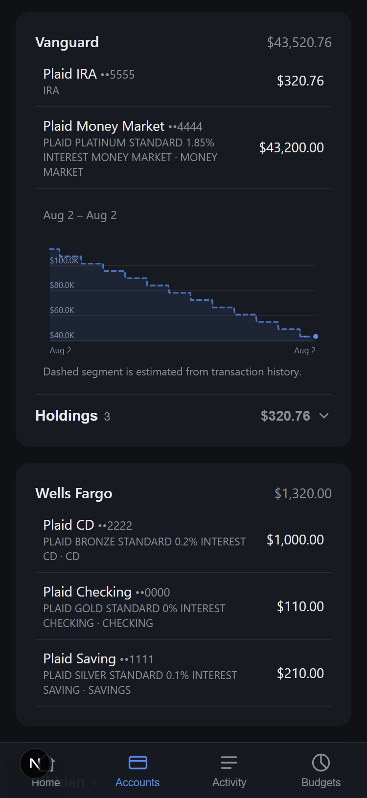
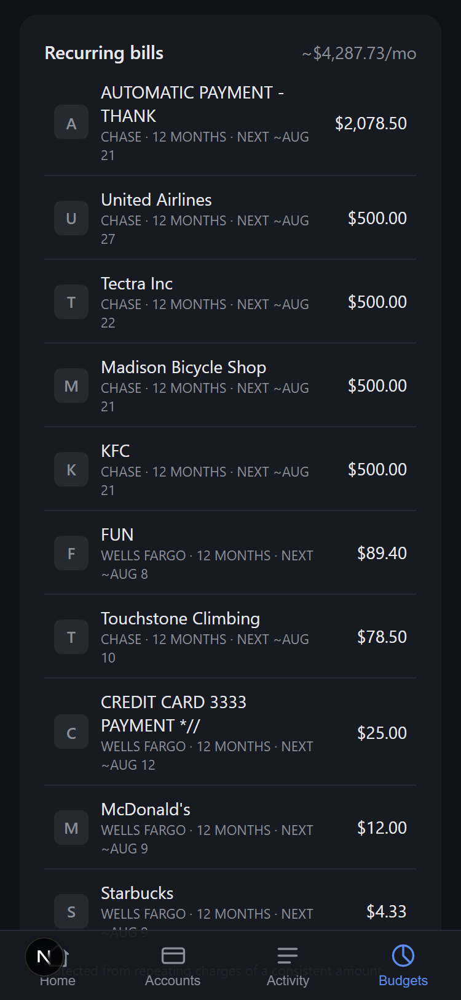

# Nya


A Next.js + React app that connects to your financial accounts — banks
(Ally, Chase), brokerages (Vanguard), credit cards, etc. — via
Plaid. Runs on Bun, deploys to Vercel, installs on your phone as a PWA.

Four tabs (bottom navigation, mobile-first):

- **Home** — net worth with a 30-day delta and an over-time chart (daily
  snapshots + estimated backfill, scrubbable), plus insights and alerts:
  over/approaching budget, low balance, upcoming recurring bills, spending
  pace vs last month, biggest purchase.
- **Accounts** — per-institution balance sheet; tap any account for its own
  balance history chart; holdings show gain/loss vs cost basis. Credit cards and
  loans carry their real terms — APR, minimum payment, and next due date, with
  statement balance, last payment, escrow and payoff date in the expanded row
  (see "Payment details" below). Investment accounts expand to show the last
  year of activity (buys, sells, dividends, fees) and how much has been
  contributed year to date. Any account can
  be **hidden**: it keeps syncing but stops counting toward anything (see
  "Hiding accounts" below). Institutions
  Plaid can't reach can be tracked as **manual accounts**: you type the
  balance, and it counts toward net worth and builds its own history like any
  linked account (see "Manual accounts" below).
- **Activity** — twelve months of transactions with a monthly breakdown:
  spending-by-month trend columns, money in/out/net, top spending
  categories, and search. Each row shows the merchant's logo, and amounts
  render in their own currency. Tap any transaction to recategorize it or
  rename its vendor — a rename applies to every transaction from that merchant
  (keyed on Plaid's merchant id, falling back to institution + name). Both are
  manual overrides that win over Plaid's data and persist. Transfers and loan
  payments are excluded from the totals so credit-card payments don't
  double-count, and a pending charge is de-duplicated against its posted
  version so a purchase isn't counted twice.
- **Budgets** — Mint-style monthly budgets per spending category with
  severity meters (on track → approaching → over); savings goals tracked
  against a linked account's live balance; and recurring-bill detection
  (merchants charging a consistent amount for 3+ months) with estimated next
  charge dates and a monthly total. All stored encrypted in Redis.

Amounts are shown in each transaction's own currency; summed figures (month
totals, budgets, recurring bills) use your most common currency and flag when
a period mixes currencies — full FX conversion isn't done, and account-level
figures (net worth, balances, goals) are still shown in `$`.

A refresh button in the header forces live Plaid data from any tab.

Plaid access tokens are encrypted (AES-256-GCM) before being stored in Upstash
Redis (via the Vercel Marketplace), and the whole app sits behind a password
(see "Security notes" below for why, and what's still not covered).

## Screenshots

_Captured in Plaid `sandbox` mode, so the balances and transactions are test
data. Anything named "Plaid ..." is a sandbox fixture; HealthEquity and Alliant
Credit Union are manual accounts added by hand. The budget meters read $0.00
because the capture was taken on the 2nd of the month, before anything had
posted against them._

The four tabs:

<table>
  <tr>
    <td align="center"><b>Home</b></td>
    <td align="center"><b>Accounts</b></td>
    <td align="center"><b>Activity</b></td>
    <td align="center"><b>Budgets</b></td>
  </tr>
  <tr>
    <td></td>
    <td></td>
    <td></td>
    <td></td>
  </tr>
</table>

Scrolling the Accounts tab: **Manage accounts** reveals the per-account
**Hide** action (plus Update and Delete on manual accounts, Disconnect on
linked institutions), hidden accounts collect in their own card at the bottom,
investment holdings expand with gain/loss against cost basis, and tapping any
account row opens that account's own balance history.

<table>
  <tr>
    <td align="center"><b>Manage accounts</b></td>
    <td align="center"><b>Hidden</b></td>
    <td align="center"><b>Holdings</b></td>
    <td align="center"><b>Per-account history</b></td>
  </tr>
  <tr>
    <td></td>
    <td></td>
    <td></td>
    <td></td>
  </tr>
</table>

Scrolling Activity gives the transaction list, grouped by day with a running
daily net on each date heading. Scrolling Budgets gives detected recurring
bills with their estimated next charge dates:

<table>
  <tr>
    <td align="center"><b>Transactions by day</b></td>
    <td align="center"><b>Recurring bills</b></td>
  </tr>
  <tr>
    <td></td>
    <td></td>
  </tr>
</table>

## 1. Get Plaid API keys

1. Sign up free at https://dashboard.plaid.com/signup
2. Go to **Team Settings → Keys** and copy your `client_id` and `sandbox` secret.

## 2. Create a Vercel project + Redis database

1. Push this folder to a GitHub repo.
2. In the [Vercel dashboard](https://vercel.com), import the repo as a new project.
3. Go to the project's **Storage** tab → **Create Database** → choose **Upstash for Redis** (Vercel KV was sunset; Upstash is its Marketplace successor) → connect it to this project. This automatically adds `UPSTASH_REDIS_REST_URL` and `UPSTASH_REDIS_REST_TOKEN` to your project's environment variables. (If you have a store that was auto-migrated from old Vercel KV, it uses the legacy `KV_REST_API_URL`/`KV_REST_API_TOKEN` names — the app supports both.)
4. Under **Settings → Environment Variables**, add:
   - `PLAID_CLIENT_ID`
   - `PLAID_SECRET`
   - `PLAID_ENV` (`sandbox` to start)
   - `PLAID_ENCRYPTION_KEY` — generate with `openssl rand -base64 32`
   - `APP_PASSWORD` — the password you'll use to open the app
   - `SESSION_SECRET` — generate with `openssl rand -base64 32`
   - `CRON_SECRET` — generate with `openssl rand -base64 32`; authenticates
     the daily net-worth snapshot cron (Vercel sends it automatically)
   - `INGEST_SECRET` (optional), generate with `openssl rand -base64 32`;
     authenticates scripted balance pushes to manual accounts. Leave it unset
     to keep that endpoint closed.

## 3. Local development

```bash
bun install
vercel link          # connects this folder to the Vercel project you just made
vercel env pull .env.local   # pulls down KV credentials + your other env vars
bun run dev
```

Open http://localhost:3000 — you'll be redirected to `/login` first.

Two checks worth running before you push:

```bash
bun run typecheck && bun run test
```

The tests need no Redis, no Plaid keys, and no network — storage and the Plaid
client are faked, so they run in well under a second.

> **If you hit `Upstash Redis client was passed an invalid URL … Received: "rediss://…"`:** `vercel env pull` sometimes writes a `rediss://…:6379` connection string into `UPSTASH_REDIS_REST_URL`, but the `@upstash/redis` client needs the HTTPS **REST** endpoint (`https://<name>.upstash.io`). The app now handles this automatically (it derives the REST URL from the host in `lib/storage.ts`), so a restart is enough. If you'd rather fix the env var itself, set `UPSTASH_REDIS_REST_URL` to the `https://…` value — Vercel exposes it as `<db-name>_KV_REST_API_URL` (or legacy `KV_REST_API_URL`).

> Bun is Vercel's officially supported runtime for the API routes (`vercel.json` sets `bunVersion`). One nuance worth knowing: `proxy.ts` (the auth gate — renamed from `middleware.ts` in Next 16) always runs on Vercel's **Edge runtime**, not Bun — that's a Next.js constraint, not a choice made here. It's why `lib/auth.ts` uses the Web Crypto API instead of Node's `crypto`/`Buffer`: that code needs to work on Edge. If a future Vercel CLI/Next.js version changes the Bun config shape, check https://vercel.com/docs/functions/runtimes/bun for the current syntax.

## 4. Connect accounts

Log in, then click **Connect an Account**. Click it again for each
additional institution — Ally, Chase, Fidelity, etc. Each one gets added to
your dashboard with a running net worth total.

If Plaid Link asks you to reconnect an institution (shown as a "Reconnect"
button on that card), that means the bank's credentials or MFA changed on
their end — click it and log back in through Plaid to fix it, no need to
disconnect and relink from scratch.

In `sandbox` mode, Plaid Link shows fake test institutions. Search for any
name (e.g. "Chase") and log in with:

- username: `user_good`
- password: `pass_good`

### Payment details

Credit cards and loans show what they actually cost: purchase APR, minimum
payment, and next due date on the account row, with statement balance, last
payment, accrued interest, escrow and payoff/maturity date when the row is
expanded. A payment coming due within a week, or one already overdue, also
surfaces as an alert on the Home tab.

This comes from Plaid's Liabilities product, which has to be enabled on an
institution before it will return anything. Newly connected institutions get it
automatically. Institutions you linked before this existed don't, so they show
an **Enable payment details** button on their card — tap it, log back in through
Plaid, and the terms appear.

That button goes through Link's *update mode*, which re-authenticates the
institution you already have rather than adding a second one: the item keeps its
id, and its stored transaction history survives. Not every institution supports
the product; where it isn't supported the button says so rather than failing
silently, and where there's simply nothing to report (no cards or loans) no
button appears at all.

### Hiding accounts

Some accounts you want synced but not counted: a joint account, a business
card, an old account kept linked for records. On the Accounts tab, tap **Manage
accounts** and then **Hide** on any account, linked or manual.

A hidden account keeps syncing and keeps being stored. It's left out of net
worth, the balance sheet, the Activity tab, budgets, insights, recurring-bill
detection, and the goal picker. Hidden accounts collect in a collapsed
**Hidden** card at the bottom of the Accounts tab, where **Unhide** restores
them.

Hiding is **retroactive**: the net-worth chart redraws as though the account was
never counted, rather than showing a cliff on the day you hid it. That works
because nothing is deleted. Snapshots keep recording the true total and every
account's balance, and hiding is applied when the chart is read, so unhiding
brings back the full history including the period while it was hidden.

Hiding is not a security feature: the data is still fetched and stored, it just
isn't shown or counted. To actually remove an account, disconnect it (Plaid) or
delete it (manual).

### When an institution can't be reached

Plaid connections fail: a bank has an outage, a login expires, an item needs
re-authenticating. When that happens Nya shows the institution's **last known
balances** with the date they were taken ("Could not fetch balances · balances
as of Aug 7") rather than a $0.00 card.

That's not cosmetic. Dropping a failed institution from the total silently
understates your debts as well as your assets, and a credit card falling out
makes net worth go *up*: a broken connection that reads as good news. Showing
the last real figures keeps the total honest while the connection is down.

Two stores back this. Balances come from the most recent daily snapshot, which
is only recorded on days when **every** institution answered. Alongside it, each
institution's account list is recorded every time **that** institution answers,
so a card you closed drops out on the next successful load rather than
lingering.

Those two have different conditions, so they drift, and an account can be in one
and not the other. When that happens the card can't show every row, and it says
so: *"2 accounts couldn't be shown, so this total is incomplete."* That matters
more than it sounds, because a missing row is usually a missing debt, and a
missing debt makes net worth look better than it is. Everything is scoped per
institution, so one bank's problems never affect another's recovery.

If the balances are older than **35 days** the card stops showing them and names
the date instead. An institution broken for months shouldn't quietly revert to
zero, and it shouldn't drag a months-old figure into today's total either.

Any institution that can't be reached and can't be recovered is called out under
the Home total, so a total that's missing a whole bank never looks complete.

Recovered balances are **display-only**. They're never written to the net-worth
history, and no snapshot is recorded on a day when any institution failed, so a
stale figure can never be mistaken for a measured one in the chart. The
consequence is a real gap: if a connection stays broken through the end of the
day, that day gets no point at all and nothing back-fills it later. That's
deliberate, because a fabricated flat line in the real history layer would be
permanent: nothing ever rewrites a past date.

An institution that needs re-authenticating keeps the red warning and its
**Reconnect** button, and only says the balances are dated. The softer amber
note is reserved for failures that usually clear on their own, so a dead
connection can't hide behind plausible-looking numbers.

### Manual accounts

Plaid's coverage is wide but uneven: small credit unions, HSAs, 401k
recordkeepers, foreign banks, and anything that isn't a financial institution
at all (property, crypto held off-exchange) may simply not be linkable. Those
get tracked by hand.

Click **Add a manual account** (on the Accounts tab, or on the empty state
before anything is connected), give it a name, an institution, a type, and a
balance. Accounts sharing an institution name group into one card. From then
on it behaves like a linked account: it counts toward net worth, appears in
the Accounts tab, is selectable as a savings-goal source, and gets its own
balance history chart.

The balance holds flat until you change it, and each update is recorded on
the timeline, so the chart shows a step at each update rather than a
pretend-smooth curve. Credit and loan balances are entered as the **amount
owed** (a positive number) and subtract from net worth.

Deleting a manual account is not reversible: re-adding it creates a new
account with a fresh id and an empty history.

#### Updating balances from a script

Retyping balances gets old. If you set `INGEST_SECRET`, anything that can make
an HTTP request can push balances into your manual accounts:

```bash
curl -X POST https://your-app.vercel.app/api/ingest/balance -H "Authorization: Bearer $INGEST_SECRET" -H 'Content-Type: application/json' -d '{"updates":[{"account_id":"manual_...","balance":1234.56}]}'
```

The `account_id` is shown in the account's edit dialog. The response reports
each id's outcome (`updated`, `not_found`, or `invalid`) so a script pointed
at a stale id fails loudly instead of looking healthy. A successful push also
records a net-worth snapshot immediately, so the chart doesn't wait for the
app to be opened.

This is the escape hatch for filling Plaid's gaps however you like. Some
options, roughly in order of how well they hold up:

- **[SimpleFIN Bridge](https://beta-bridge.simplefin.org/)** (~$15/yr,
  read-only, daily refresh) is purpose-built for personal aggregation and is
  what Actual Budget and Firefly III use. It sometimes covers institutions
  Plaid misses.
- **OFX Direct Connect**, the pre-Plaid standard, is still enabled at many
  credit unions (often needing a separate enrollment and PIN) and is
  scriptable with [`ofxtools`](https://github.com/csingley/ofxtools). Check
  the [GnuCash bank list](https://wiki.gnucash.org/wiki/OFX_Direct_Connect_Bank_Settings)
  for a given institution. The industry is migrating away from it, so treat it
  as a bonus where it exists.
- **Other aggregators** (Teller, MX, Akoya, Finicity) generally have
  *narrower* long-tail coverage than Plaid, so they rarely help with the exact
  institutions Plaid is missing.
- **Scraping your own account** is possible but a maintenance treadmill: MFA
  and device binding break it, bank logins from datacenter IPs get flagged (so
  it can't run on Vercel), most bank terms prohibit automated access, and the
  failure mode is a locked account rather than a stale number. If you do it,
  run it on your own machine and push the result here rather than storing bank
  credentials in this app.

Note that the endpoint only *updates* accounts that already exist. It can't
create them, so a leaked token can't invent accounts.

## 5. Deploy

```bash
vercel deploy --prod
```

Vercel gives you a free HTTPS domain automatically — no separate hosting step needed.

**One Plaid-specific step:** in the [Plaid Dashboard](https://dashboard.plaid.com), under Team Settings → API, add your deployed URL to the allowed redirect URIs (some bank logins use OAuth screens that redirect back to a registered domain).

## 6. Install on your phone

**iPhone (Safari):** open your deployed URL → Share icon → **Add to Home Screen**

**Android (Chrome):** open your deployed URL → ⋮ menu → **Install app**

---

## Security notes

### Password gate

Deploying to Vercel gives the app a public HTTPS URL — anyone who found it
could otherwise view your balances or link their own account into your
Redis store. Every route (except `/login` and the PWA assets needed for install)
is now gated by `proxy.ts` (Next's renamed middleware convention), which
checks a signed, expiring session cookie. Logging in at `/login` sets that
cookie for 30 days.

This is a single shared password, not per-user accounts — appropriate for
one person's personal tracker, not for sharing with others. If you want
real multi-user auth later, swap this for something like NextAuth/Auth.js
or Clerk rather than extending the password system.

### Token encryption

Each Plaid access token is encrypted (AES-256-GCM) with `PLAID_ENCRYPTION_KEY`
before being written to Redis — see `lib/crypto.ts`. That key lives only in
your env vars, never in Redis itself, so a database-only leak doesn't expose
usable tokens.

Balance and transaction responses are also cached in Redis for 15 minutes
(so the dashboard doesn't wait on live Plaid calls every load — the Refresh
button forces a live fetch), encrypted with the same key. See `lib/cache.ts`.
The daily net-worth history behind the Home-tab chart (`lib/history.ts`) is
stored the same way: encrypted values, keyed by date. It has two layers:

- **Real snapshots** — recorded on every clean live fetch, plus daily by a
  Vercel Cron (`vercel.json` → `/api/snapshot`, authenticated with
  `CRON_SECRET`), so the chart stays gapless even on days you don't open
  the app. Per-account balances are snapshotted alongside the total, which
  is what feeds the tap-to-expand account charts.
- **Estimated backfill** — on first use (and after linking a new
  institution) the app reconstructs up to a year of history from
  transaction data (`/api/backfill`), at three levels of fidelity:
  cash and credit accounts are walked backward from today's balances,
  un-applying each day's transactions; investment accounts have their
  external flows (deposits, withdrawals, dividends, fees) un-applied the
  same way, but market movement isn't a transaction and can't be recovered,
  so price changes within the window are not modelled; loans and manual
  accounts are held flat, since amortization isn't in the transaction
  stream and a typed balance has no stream at all. The chart draws the
  whole region dashed and labels it estimated. An institution whose
  investments product isn't available falls back to flat for those accounts
  without affecting the rest of the run. New links request 730 days of
  transactions; older Items may only have ~90 days until relinked.

One deliberate tradeoff: the dashboard keeps the last-known snapshot in the
browser's `localStorage` so the PWA opens instantly and still shows balances
offline. That snapshot is readable on-device without the app password (e.g.
by someone with your unlocked phone) — acceptable for a personal device, but
worth knowing. It's cleared on logout.

**Keep `PLAID_ENCRYPTION_KEY` and `SESSION_SECRET` safe** — losing the
encryption key makes previously stored tokens permanently undecryptable
(you'd need to reconnect all accounts); losing/leaking the session secret
would let someone forge a valid login cookie.

### Login rate limiting

`/api/login` allows at most 10 failed attempts per IP per 15 minutes
(tracked in Redis; a successful login clears the counter, and the limiter
fails open if Redis is unreachable). This blunts brute-forcing of
`APP_PASSWORD` on the public URL.

### What's still not covered

- **Single household password**, not per-device or per-person sessions —
  anyone with the password gets full access, including the ability to
  disconnect your accounts.
- Rate limiting covers only the login endpoint, not the data routes (those
  already require a valid session).

## Limitations

- **Test coverage is narrow by design.** `bun test` covers the pure logic where
  a silent wrong answer is worst: the net-worth history layers
  (`lib/history.ts` — real-vs-estimated merging, retention across recomputes,
  and hidden-account subtraction), Plaid's investment sign conventions and
  pagination (`lib/investments.ts`), liability normalization
  (`lib/liabilities.ts`), the credit/loan sign rule that every total depends on
  (`lib/balance.ts`), and last-known-balance recovery for a failed institution
  (`lib/last-known.ts`). Routes, React components and anything talking to live
  Plaid are not covered.
- **Liabilities is a paid Plaid product.** Free in `sandbox`, but billed per
  Item per month in `production`, so enabling payment details on many
  institutions has a running cost. Investments (holdings and activity) is
  billed the same way.
- **Reconstructed investment history ignores market movement.** The estimated
  region removes contributions and withdrawals, so it no longer applies this
  year's deposits retroactively, but Plaid exposes no historical prices — a
  portfolio that doubled looks flat until real snapshots take over. Dividends
  a broker reports as a single reinvestment row are counted as internal and
  missed entirely.
- **Manual balances are only as fresh as your last update.** They hold flat
  between updates, so a stale one quietly overstates or understates net worth.
  Each card shows when it was last updated. Automate it with
  `/api/ingest/balance` if a given account matters.
- **Offline is read-only last-known data** — the PWA opens with the last
  snapshot from `localStorage`, but refreshing, linking, and transactions
  need a network connection (`/api/*` responses are never cached by the
  service worker).

## Extending this

- Push notifications (PWA web push) for budget alerts and upcoming bills
- Goal target dates with required-monthly-savings math
- Currency-aware account-level figures — transaction views already render each
  amount in its own currency and flag mixed-currency totals, but net worth,
  balances, and goals still show `$` because the live-balance path doesn't
  surface a currency code yet.
- Debt payoff planning on top of the new liabilities data: interest paid per
  month, avalanche vs snowball ordering, a debt-free date on the net-worth chart.
- Plaid webhooks (`SYNC_UPDATES_AVAILABLE`, `ITEM_LOGIN_REQUIRED`) to replace
  the 15-minute cache and daily cron with near-live updates, and to surface a
  broken institution before you next open the app.

The `plaid-data-unlock` GitHub issues that tracked the earlier round of
unused-Plaid-field features are all closed and shipped.
