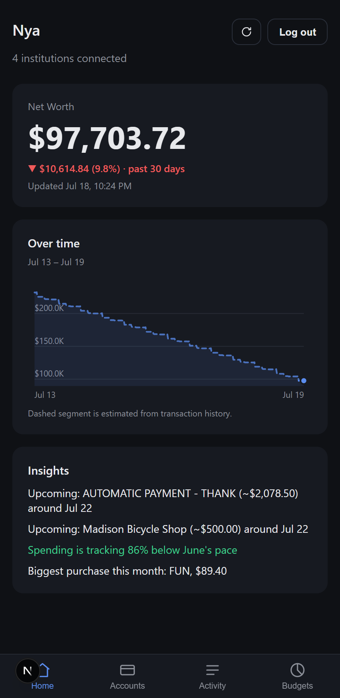
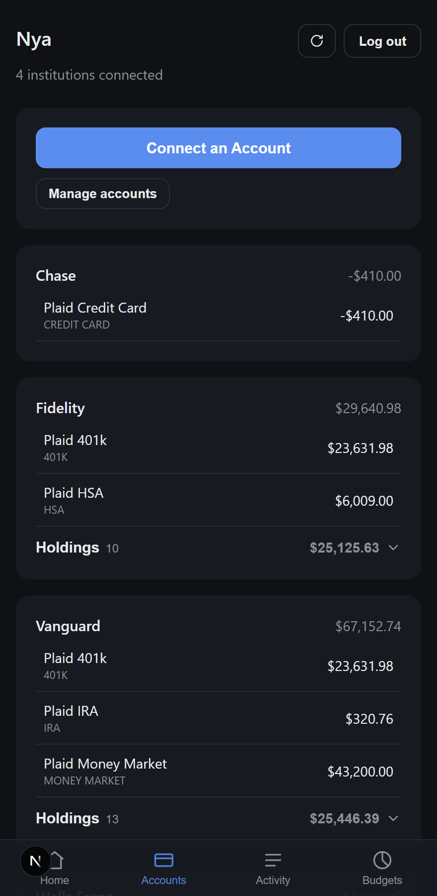
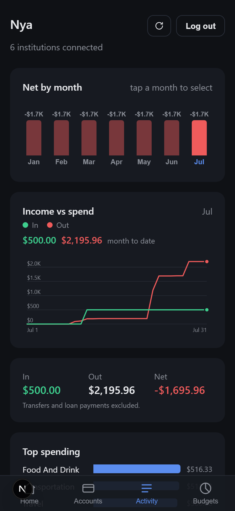
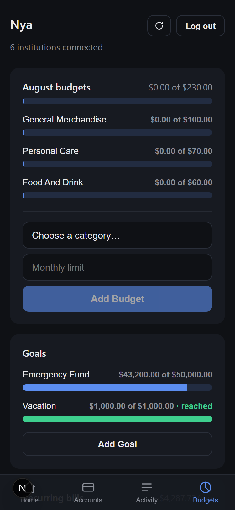
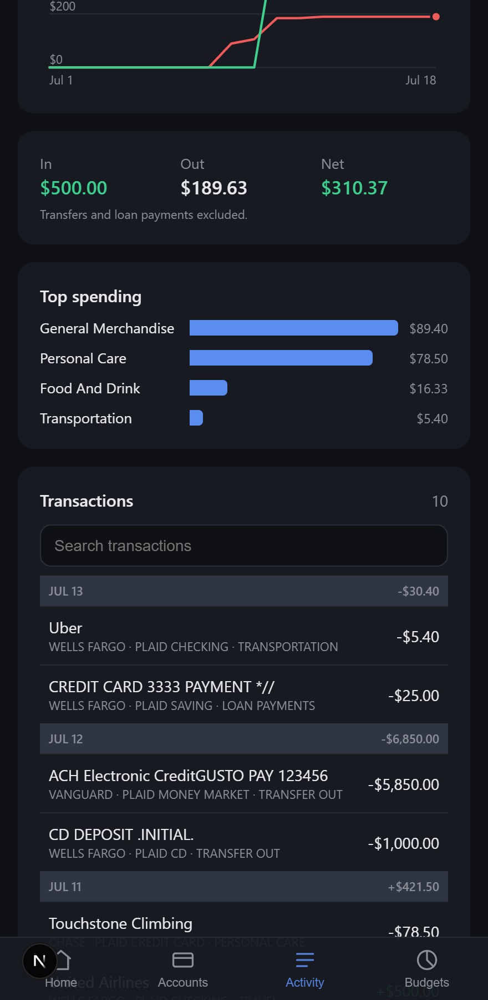

# Nya


A Next.js + React app that connects to your financial accounts — banks
(Ally, Chase), brokerages (Vanguard), credit cards, etc. — via
Plaid. Runs on Bun, deploys to Vercel, installs on your phone as a PWA.

Four tabs (bottom navigation, mobile-first):

- **Home** — net worth with a 30-day delta and an over-time chart (daily
  snapshots + estimated backfill, scrubbable), plus insights and alerts:
  over/approaching budget, low balance, upcoming recurring bills, spending
  pace vs last month, biggest purchase.
- **Accounts** — per-institution balance sheet; tap any account for its own
  balance history chart; holdings show gain/loss vs cost basis.
- **Activity** — twelve months of transactions with a monthly breakdown:
  spending-by-month trend columns, money in/out/net, top spending
  categories, and search. Each row shows the merchant's logo, and amounts
  render in their own currency. Tap any transaction to recategorize it or
  rename its vendor — a rename applies to every transaction from that merchant
  (keyed on Plaid's merchant id, falling back to institution + name). Both are
  manual overrides that win over Plaid's data and persist. Transfers and loan
  payments are excluded from the totals so credit-card payments don't
  double-count, and a pending charge is de-duplicated against its posted
  version so a purchase isn't counted twice.
- **Budgets** — Mint-style monthly budgets per spending category with
  severity meters (on track → approaching → over); savings goals tracked
  against a linked account's live balance; and recurring-bill detection
  (merchants charging a consistent amount for 3+ months) with estimated next
  charge dates and a monthly total. All stored encrypted in Redis.

Amounts are shown in each transaction's own currency; summed figures (month
totals, budgets, recurring bills) use your most common currency and flag when
a period mixes currencies — full FX conversion isn't done, and account-level
figures (net worth, balances, goals) are still shown in `$`.

A refresh button in the header forces live Plaid data from any tab.

Plaid access tokens are encrypted (AES-256-GCM) before being stored in Upstash
Redis (via the Vercel Marketplace), and the whole app sits behind a password
(see "Security notes" below for why, and what's still not covered).

## Screenshots

_Captured in Plaid `sandbox` mode, so the balances and transactions are test data._

<table>
  <tr>
    <td align="center"><b>Home</b></td>
    <td align="center"><b>Accounts</b></td>
    <td align="center"><b>Activity</b></td>
    <td align="center"><b>Budgets</b></td>
  </tr>
  <tr>
    <td></td>
    <td></td>
    <td></td>
    <td></td>
  </tr>
</table>

The Activity tab's transaction list groups by day, with a running daily net on
each date heading:



## 1. Get Plaid API keys

1. Sign up free at https://dashboard.plaid.com/signup
2. Go to **Team Settings → Keys** and copy your `client_id` and `sandbox` secret.

## 2. Create a Vercel project + Redis database

1. Push this folder to a GitHub repo.
2. In the [Vercel dashboard](https://vercel.com), import the repo as a new project.
3. Go to the project's **Storage** tab → **Create Database** → choose **Upstash for Redis** (Vercel KV was sunset; Upstash is its Marketplace successor) → connect it to this project. This automatically adds `UPSTASH_REDIS_REST_URL` and `UPSTASH_REDIS_REST_TOKEN` to your project's environment variables. (If you have a store that was auto-migrated from old Vercel KV, it uses the legacy `KV_REST_API_URL`/`KV_REST_API_TOKEN` names — the app supports both.)
4. Under **Settings → Environment Variables**, add:
   - `PLAID_CLIENT_ID`
   - `PLAID_SECRET`
   - `PLAID_ENV` (`sandbox` to start)
   - `PLAID_ENCRYPTION_KEY` — generate with `openssl rand -base64 32`
   - `APP_PASSWORD` — the password you'll use to open the app
   - `SESSION_SECRET` — generate with `openssl rand -base64 32`
   - `CRON_SECRET` — generate with `openssl rand -base64 32`; authenticates
     the daily net-worth snapshot cron (Vercel sends it automatically)

## 3. Local development

```bash
bun install
vercel link          # connects this folder to the Vercel project you just made
vercel env pull .env.local   # pulls down KV credentials + your other env vars
bun run dev
```

Open http://localhost:3000 — you'll be redirected to `/login` first.

> **If you hit `Upstash Redis client was passed an invalid URL … Received: "rediss://…"`:** `vercel env pull` sometimes writes a `rediss://…:6379` connection string into `UPSTASH_REDIS_REST_URL`, but the `@upstash/redis` client needs the HTTPS **REST** endpoint (`https://<name>.upstash.io`). The app now handles this automatically (it derives the REST URL from the host in `lib/storage.ts`), so a restart is enough. If you'd rather fix the env var itself, set `UPSTASH_REDIS_REST_URL` to the `https://…` value — Vercel exposes it as `<db-name>_KV_REST_API_URL` (or legacy `KV_REST_API_URL`).

> Bun is Vercel's officially supported runtime for the API routes (`vercel.json` sets `bunVersion`). One nuance worth knowing: `proxy.ts` (the auth gate — renamed from `middleware.ts` in Next 16) always runs on Vercel's **Edge runtime**, not Bun — that's a Next.js constraint, not a choice made here. It's why `lib/auth.ts` uses the Web Crypto API instead of Node's `crypto`/`Buffer`: that code needs to work on Edge. If a future Vercel CLI/Next.js version changes the Bun config shape, check https://vercel.com/docs/functions/runtimes/bun for the current syntax.

## 4. Connect accounts

Log in, then click **Connect an Account**. Click it again for each
additional institution — Ally, Chase, Fidelity, etc. Each one gets added to
your dashboard with a running net worth total.

If Plaid Link asks you to reconnect an institution (shown as a "Reconnect"
button on that card), that means the bank's credentials or MFA changed on
their end — click it and log back in through Plaid to fix it, no need to
disconnect and relink from scratch.

In `sandbox` mode, Plaid Link shows fake test institutions. Search for any
name (e.g. "Chase") and log in with:

- username: `user_good`
- password: `pass_good`

## 5. Deploy

```bash
vercel deploy --prod
```

Vercel gives you a free HTTPS domain automatically — no separate hosting step needed.

**One Plaid-specific step:** in the [Plaid Dashboard](https://dashboard.plaid.com), under Team Settings → API, add your deployed URL to the allowed redirect URIs (some bank logins use OAuth screens that redirect back to a registered domain).

## 6. Install on your phone

**iPhone (Safari):** open your deployed URL → Share icon → **Add to Home Screen**

**Android (Chrome):** open your deployed URL → ⋮ menu → **Install app**

---

## Security notes

### Password gate

Deploying to Vercel gives the app a public HTTPS URL — anyone who found it
could otherwise view your balances or link their own account into your
Redis store. Every route (except `/login` and the PWA assets needed for install)
is now gated by `proxy.ts` (Next's renamed middleware convention), which
checks a signed, expiring session cookie. Logging in at `/login` sets that
cookie for 30 days.

This is a single shared password, not per-user accounts — appropriate for
one person's personal tracker, not for sharing with others. If you want
real multi-user auth later, swap this for something like NextAuth/Auth.js
or Clerk rather than extending the password system.

### Token encryption

Each Plaid access token is encrypted (AES-256-GCM) with `PLAID_ENCRYPTION_KEY`
before being written to Redis — see `lib/crypto.ts`. That key lives only in
your env vars, never in Redis itself, so a database-only leak doesn't expose
usable tokens.

Balance and transaction responses are also cached in Redis for 15 minutes
(so the dashboard doesn't wait on live Plaid calls every load — the Refresh
button forces a live fetch), encrypted with the same key. See `lib/cache.ts`.
The daily net-worth history behind the Home-tab chart (`lib/history.ts`) is
stored the same way: encrypted values, keyed by date. It has two layers:

- **Real snapshots** — recorded on every clean live fetch, plus daily by a
  Vercel Cron (`vercel.json` → `/api/snapshot`, authenticated with
  `CRON_SECRET`), so the chart stays gapless even on days you don't open
  the app. Per-account balances are snapshotted alongside the total, which
  is what feeds the tap-to-expand account charts.
- **Estimated backfill** — on first use (and after linking a new
  institution) the app reconstructs up to a year of history from
  transaction data (`/api/backfill`): cash and credit accounts are walked
  backward from today's balances; investments and loans can't be
  reconstructed (Plaid has no historical balances or prices) and are held
  flat. The chart draws this region dashed and labels it estimated. New
  links request 730 days of transactions; older Items may only have ~90
  days until relinked.

One deliberate tradeoff: the dashboard keeps the last-known snapshot in the
browser's `localStorage` so the PWA opens instantly and still shows balances
offline. That snapshot is readable on-device without the app password (e.g.
by someone with your unlocked phone) — acceptable for a personal device, but
worth knowing. It's cleared on logout.

**Keep `PLAID_ENCRYPTION_KEY` and `SESSION_SECRET` safe** — losing the
encryption key makes previously stored tokens permanently undecryptable
(you'd need to reconnect all accounts); losing/leaking the session secret
would let someone forge a valid login cookie.

### Login rate limiting

`/api/login` allows at most 10 failed attempts per IP per 15 minutes
(tracked in Redis; a successful login clears the counter, and the limiter
fails open if Redis is unreachable). This blunts brute-forcing of
`APP_PASSWORD` on the public URL.

### What's still not covered

- **Single household password**, not per-device or per-person sessions —
  anyone with the password gets full access, including the ability to
  disconnect your accounts.
- Rate limiting covers only the login endpoint, not the data routes (those
  already require a valid session).

## Limitations

- **No automated tests.**
- **Offline is read-only last-known data** — the PWA opens with the last
  snapshot from `localStorage`, but refreshing, linking, and transactions
  need a network connection (`/api/*` responses are never cached by the
  service worker).

## Extending this

- Push notifications (PWA web push) for budget alerts and upcoming bills
- Goal target dates with required-monthly-savings math
- Currency-aware account-level figures — transaction views already render each
  amount in its own currency and flag mixed-currency totals, but net worth,
  balances, and goals still show `$` because the live-balance path doesn't
  surface a currency code yet. More unbuilt features (spending map, credit
  utilization, subcategory drill-down, …) are tracked as GitHub issues under
  the `plaid-data-unlock` label.
