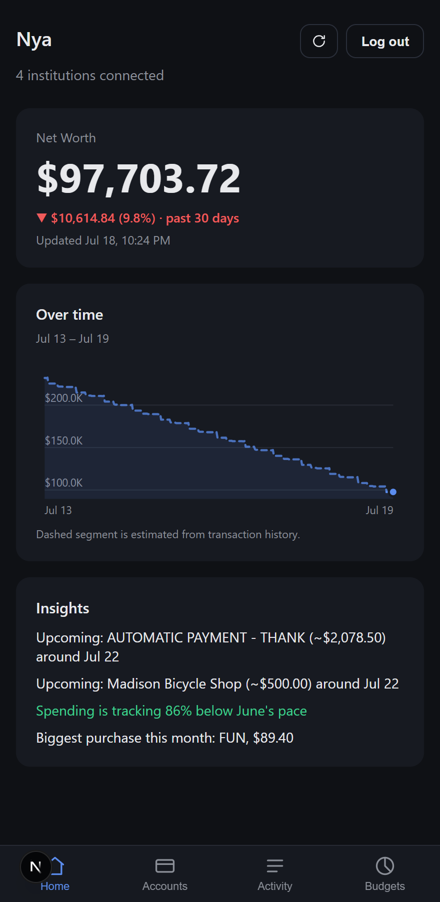
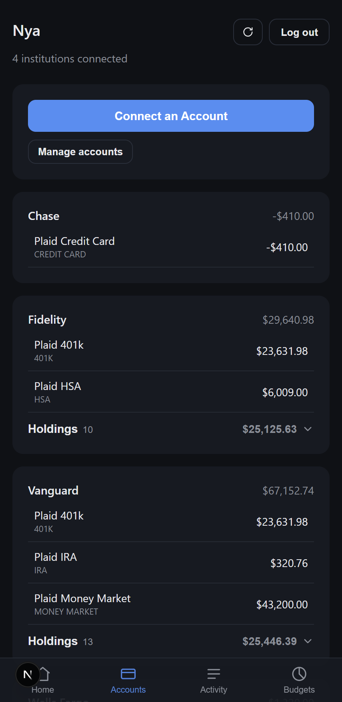
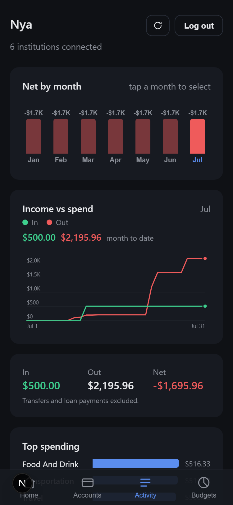
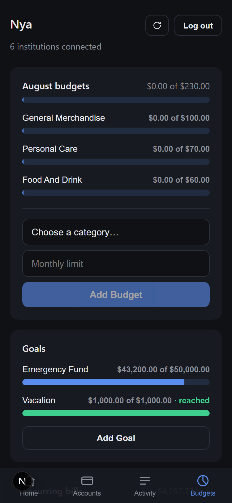
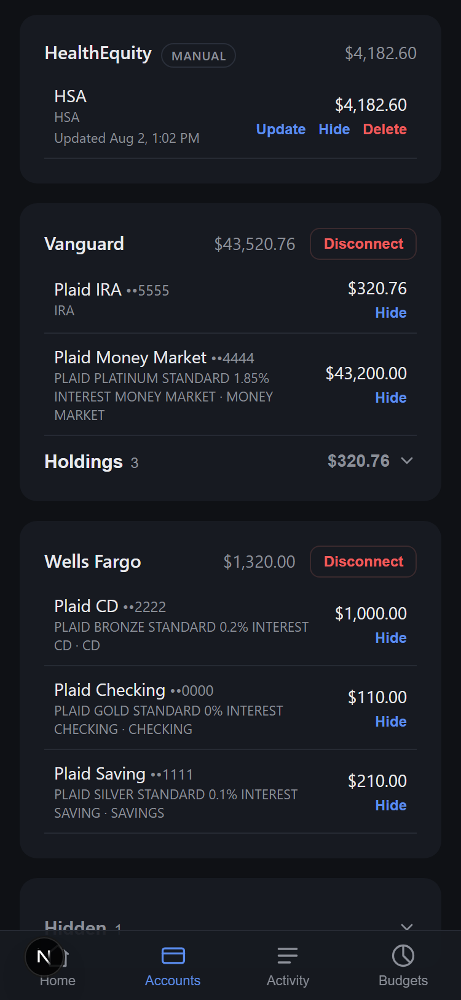
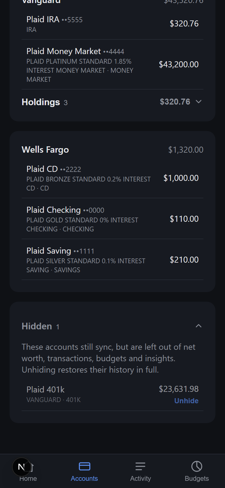
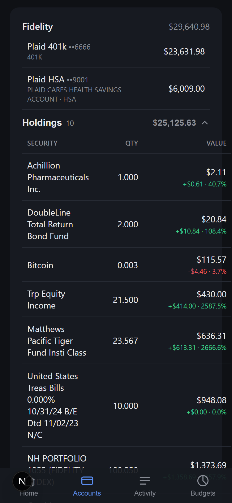
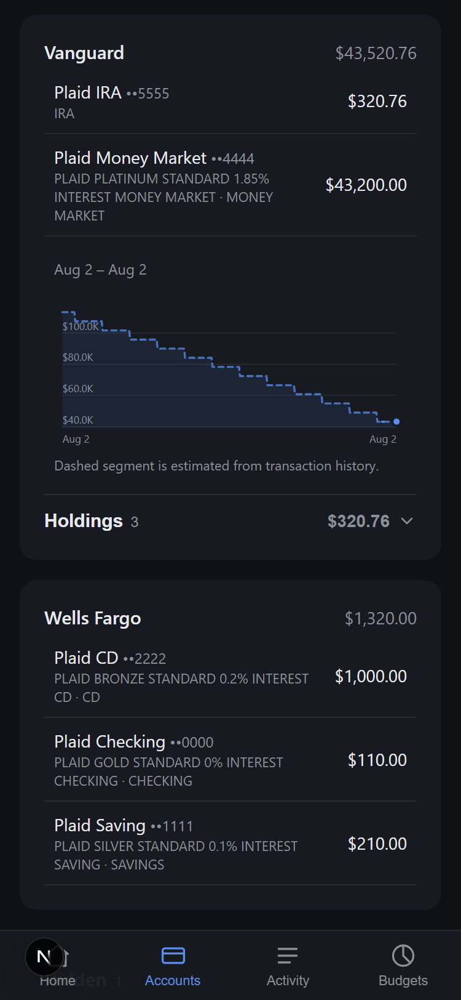
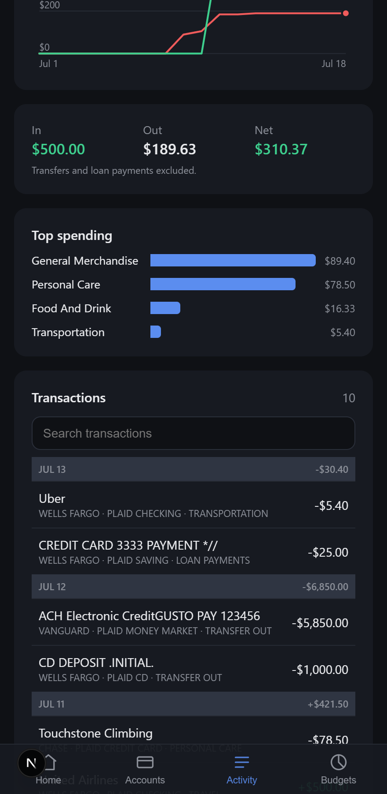
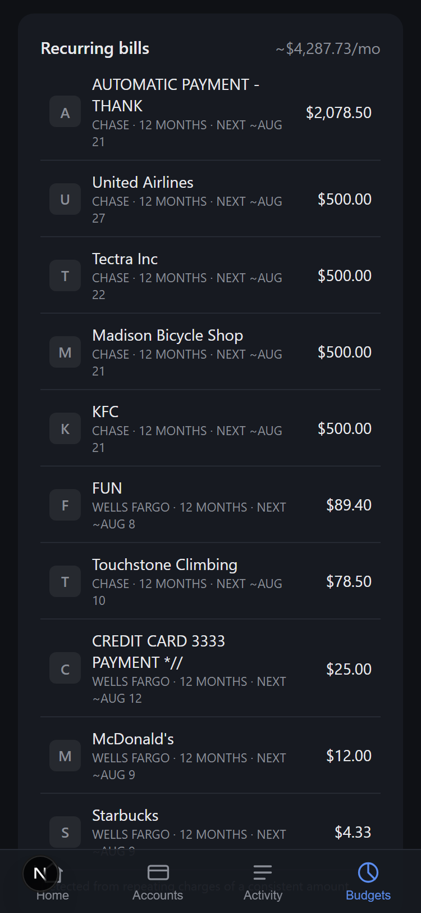

# Nya


A personal finance tracker built with Next.js and React. It connects to your financial accounts at US institutions through Plaid (banks, credit cards, loans, brokerages and retirement accounts such as 401(k)s) and keeps a running net worth, a year of transactions, budgets and savings goals, and works out when you could be financially independent and how a retirement would have lasted. It runs on Bun, deploys to Vercel, encrypts your financial data before storing it in Upstash Redis (dates, ids and a few names stay plain text; see [Architecture](docs/architecture.md#storage-and-encryption)), and installs on your phone as a PWA.

**[Try the live demo](https://nya-git-preview-fueroberthers-projects.vercel.app/?_vercel_share=hsOPuA6Qvofd4jxnrQVjuqXhPVkNqykh)** and sign in with one of the two **demo accounts** (Alex or Sam). It runs against Plaid's sandbox on its own database, so every account and balance you see there is fake. Everyone who tries the demo shares those accounts, so anything you add is visible to other visitors. See [Demo accounts](docs/authentication.md#demo-accounts-preview-only) and [Preview deployments](docs/deployment.md#preview-deployments) for how it is wired.

## What it does

Five tabs, mobile-first, with bottom navigation:

- **Home**: net worth with a 30-day delta and a scrubbable over-time chart (daily snapshots plus an estimated backfill), insights and alerts (a bank connection about to end, budgets over or approaching their limit, low balances, uninvested cash sitting in a brokerage, upcoming recurring bills and payments due, spending pace against last month, and the biggest purchase), and below them a small FI card with the Plan's FI number, years to FI and your savings rate over the last year (estimates, labelled as such, from the same figures as the Plan tab). When a bank can't be reached, the notes under the total name it and say when it was last seen.
- **Accounts**: a per-institution balance sheet. Tap an account for its own balance history. Holdings show gain or loss against cost basis, and money that isn't actually invested (a settlement fund, a sweep account) is marked and flagged once it is large enough to be worth placing. Credit cards and loans show their APR, minimum payment and due date, and a **payoff plan** works out when they're paid off and the interest that costs, highest rate first (avalanche) or smallest balance first (snowball), against paying only the minimums. Investment accounts show the last year of activity and this year's contributions, with rollovers counted separately from money saved, and their holdings are recorded each day Nya can fetch them, since Plaid keeps no history of them. Two ways to connect: **Connect a bank or card**, and, where the deployment turns it on, **Connect a brokerage or retirement account** for 401(k)s, IRAs and brokerages, including ones the bank option can't find. Any account can be **hidden** (still syncing, no longer counted), and institutions Plaid can't reach can be tracked as **manual accounts**. **Connection health** lists every linked institution with its state, when it last synced, whose side a problem is on and what to do (reconnect, wait, or remove and connect again), and a connection Plaid says will end shows **Reconnect soon** with the date.
- **Activity**: twelve months of transactions with a monthly breakdown (trend columns, money in, out and net, top categories) and search. Recategorize a transaction or rename a vendor; both are manual overrides that persist, and a rename applies to every transaction from that merchant. Transfers and loan payments are left out of the totals (a bank's fees count as spending), and a pending charge is de-duplicated against its posted version. **Add a transaction** by hand (cash, a bank Plaid can't reach) to a manual account, in its own currency, from a quick form built for a phone; it counts like a bank's, is saved once however often a flaky connection sends it, and moves the account's typed balance only if you ask. **Import a file** your bank exports (OFX or QFX, CSV with your own column mapping, QIF) into a manual account: a preview shows what is new, what is already there and any line that can't be read, importing the same file again adds nothing, and an import can be undone in one step. Any posted transaction can be **excluded from budgets and reports** (a one-off): it stays listed, marked, and drops out of every total, its day's subtotal included, and stays excluded across a reconnect once the new account is linked to the old. A month whose transactions may be incomplete, because a bank couldn't be read or stopped syncing before it ended, says so under its totals.
- **Budgets**: monthly budgets per spending category with severity meters, savings goals tracked against a linked account's live balance, and recurring-bill detection with estimated next charge dates.
- **Plan**: financial independence from your own data. The FI number, years to FI, Coast FI and Barista FI, from your last year of spending (mortgage, car, student and personal loan payments and cash included), your invested assets and an estimate of your savings (workplace plan contributions included). Each input is labelled with its dates and anything that may be missing from it, and can be typed over. A retirement simulator runs historical cycles on monthly US data since 1871, or a seeded Monte Carlo, with five withdrawal rules (constant, percent of portfolio, Guyton-Klinger guardrails, VPW, floor and ceiling), other income, one-off expenses, fees and a flat tax. It shows the success rate with its definition (and, for a rule that cuts spending, how far it fell), a fan chart, the worst starting years, a grid by withdrawal rate and length, and every assumption beside the result. **Allocation** shows your investment accounts by asset class and by tax bucket, from the account's type, the security's type and a hand-checked list of broad index funds, with your own splits and buckets winning and anything else shown as unclassified, never guessed; drift against a target you set; the mix over time from recorded holdings; and the simulation's stock, bond and cash mix taken from it when you confirm, with what was left out named. See [Planning](docs/features.md#planning).

Amounts are shown in the currency they carry, and nothing is converted between currencies. Totals of transactions (the month's totals and its day subtotals, budgets, recurring bills, the Home insights, the Plan) add up only the currency most of your transactions are in and say how many in other currencies they left out; a transaction with no currency code, which only the oldest stored history has, counts as that currency. Net worth is labelled with your most common currency and says so when your accounts mix currencies. The header's refresh button bypasses the cache and re-reads from Plaid.

More than one person can use a deployment: sign in with Clerk and each account gets its own data, with optional read-only sharing between people who connect: you choose what each person sees and for how long, see exactly what they see, and both of you see each time it was shown to them. Otherwise a single shared password protects the app. See [docs/authentication.md](docs/authentication.md).

When a bank connection breaks, Nya sends one email (and one reminder a week later if it is still broken) naming the bank and what to do, never an amount, once email is set up (see [docs/deployment.md](docs/deployment.md#email-notices)).

Your data is yours to take: under **Manage**, **Download my data** gives you everything Nya stores about you, decrypted, as one JSON file or as CSV files of your transactions and balance history, after a fresh sign-in (see [docs/data-export.md](docs/data-export.md)). Deleting your account ends with a receipt of what was deleted, when the last backup holding it expires, and what stays with Plaid.

Two pages anyone can open without signing in, `/security` and `/privacy`, say in plain language how the data is protected, who can read what (whoever runs the deployment included), how long things are kept, and how to delete it. Every response carries security headers, and every page a Content-Security-Policy; see [Security headers](docs/deployment.md#security-headers-and-the-content-security-policy).

## Screenshots

Captured in Plaid `sandbox` mode, so the balances and transactions are test data. Anything named "Plaid ..." is a sandbox fixture; HealthEquity and Alliant Credit Union are manual accounts added by hand. The budget meters read $0.00 because the capture was taken on the 2nd of the month, before anything had posted against them.

<table>
  <tr>
    <td align="center"><b>Home</b></td>
    <td align="center"><b>Accounts</b></td>
    <td align="center"><b>Activity</b></td>
    <td align="center"><b>Budgets</b></td>
  </tr>
  <tr>
    <td></td>
    <td></td>
    <td></td>
    <td></td>
  </tr>
</table>

On the Accounts tab, **Manage accounts** reveals per-account actions (Hide, plus Update and Delete on manual accounts and Disconnect on linked institutions), hidden accounts collect in their own card, holdings expand with gain or loss against cost basis, and any account row opens that account's own balance history.

<table>
  <tr>
    <td align="center"><b>Manage accounts</b></td>
    <td align="center"><b>Hidden</b></td>
    <td align="center"><b>Holdings</b></td>
    <td align="center"><b>Per-account history</b></td>
  </tr>
  <tr>
    <td></td>
    <td></td>
    <td></td>
    <td></td>
  </tr>
</table>

Activity lists transactions grouped by day with a running daily net on each date heading, and Budgets lists detected recurring bills with their estimated next charge dates.

<table>
  <tr>
    <td align="center"><b>Transactions by day</b></td>
    <td align="center"><b>Recurring bills</b></td>
  </tr>
  <tr>
    <td></td>
    <td></td>
  </tr>
</table>

## Quick start

You need a [Plaid](https://dashboard.plaid.com/signup) account (the free sandbox is enough to start), a [Vercel](https://vercel.com) project, and [Bun](https://bun.sh).

1. **Get Plaid keys.** Under Team Settings > Keys, copy your `client_id` and `sandbox` secret.
2. **Create the Vercel project.** Import the repo, then add an **Upstash for Redis** database from the project's Storage tab.
3. **Set environment variables.** At minimum: `PLAID_CLIENT_ID`, `PLAID_SECRET`, `PLAID_ENV=sandbox`, `PLAID_ENCRYPTION_KEY`, `APP_PASSWORD`, `SESSION_SECRET` and `CRON_SECRET`. Generate keys and secrets with `openssl rand -base64 32`. The full list is in [docs/deployment.md](docs/deployment.md#3-environment-variables) and [`.env.example`](.env.example).
4. **Run it locally.**

   ```bash
   bun install
   vercel link
   vercel env pull .env.local
   bun run dev
   ```

   Open <http://localhost:3000>. Logging in with the shared password needs a container to exist; see [Containers](docs/operations.md#containers).
5. **Connect an account.** Log in and click **Connect a bank or card** (or, with `PLAID_BROKERAGE_LINK=1` set, **Connect a brokerage or retirement account** for a 401(k), IRA or brokerage). In sandbox mode, search for any institution and use username `user_good` and password `pass_good`.
6. **Deploy** with `vercel deploy --prod`, then install it on your phone from the browser's share or install menu.

Before you push, run `bun run typecheck && bun run test`. The tests need no Redis, Plaid keys or network.

## Documentation

| Guide | What is in it |
| --- | --- |
| [Deployment](docs/deployment.md) | Plaid and Vercel setup, every environment variable, scheduled jobs, local development, security headers and the Content-Security-Policy, preview deployments. |
| [Features in depth](docs/features.md) | Reconnecting and linking history, payment details, the debt payoff plan, hiding accounts, unreachable institutions with connection health, Reconnect soon and email notices, manual accounts and scripted balances, importing files, keeping Plaid costs down, planning (the FI figures, the simulator, its data and its limits, allocation and the FI card on Home). |
| [Authentication and sharing](docs/authentication.md) | The password gate, sessions, Clerk sign-in, adding people, account deletion and its receipt, sharing, demo accounts. |
| [Downloading your data](docs/data-export.md) | Getting everything Nya stores about you: the JSON and CSV formats field by field, what is left out, and how it differs from the operator backup. |
| [Architecture](docs/architecture.md) | Storage and encryption, the storage seam new stores are built on, caching, how net-worth history is recorded and reconstructed, containers. |
| [Operations](docs/operations.md) | Backups and restores, encryption key setup and rotation, containers, the one-time data move. |

## Limitations

- **Reconstructed investment history ignores market movement.** The estimated region removes contributions and withdrawals, but Plaid exposes no historical prices, so a portfolio that doubled looks flat until real snapshots take over. Dividends a broker reports as a single reinvestment row are counted as internal and missed.
- **Holdings history starts when recording starts.** Plaid keeps no past holdings, so what an investment account held is known only from the first day Nya recorded it (each account says since when), and a day it missed, such as one its institution could not be reached, stays missing.
- **Balances can be up to a day behind.** They come from the balances Plaid already holds rather than its billed live-balance call, which keeps costs down.
- **Manual balances are only as fresh as your last update.** They hold flat between updates, so a stale one quietly overstates or understates net worth. Each card shows when it was last updated; automate it with `/api/ingest/balance` if an account matters.
- **Imported files go into manual accounts only, and are matched exactly.** Importing into a linked account, where a bank's file overlaps what Plaid synced, needs looser matching and a review step first (#52). A bank's CSV and its OFX describe the same transaction differently, so import one format into an account.
- **Liabilities and Investments are paid Plaid products.** Free in `sandbox`, billed per institution per month in `production`.
- **A brokerage or retirement connection brings no spending transactions** unless it holds a bank (depository) account or a card, which Plaid's Link may not offer on it at all. It carries balances, holdings and investment activity; connect everyday accounts with **Connect a bank or card**. The option is off unless the deployment sets `PLAID_BROKERAGE_LINK=1` ([docs/deployment.md](docs/deployment.md#brokerage-and-retirement-connections)).
- **Connection notices are email only, and need email set up.** Without `RESEND_API_KEY` and `MAIL_FROM`, the Connection health card is the only place a broken connection shows. There is no push notification.
- **Offline is read-only last-known data.** The PWA opens with the last snapshot from `localStorage`, but refreshing, linking, transactions and the Plan tab's saved assumptions need a network connection.
- **The shared password is one secret for everyone who has it.** Use Clerk for more than one person.
- **Plan results are hypothetical.** They come from US market history only, with taxes as one flat rate and the stock and bond mix you set or take from your allocation (Nya doesn't look inside funds beyond the index funds it lists, so any other fund stays unclassified until you split it). The data is Shiller's, whose page states no license terms: check before any paid use. See [Planning](docs/features.md#limits).
- **Bank connections are US only.** Both link-token routes ask Plaid for US institutions. Anything else is tracked as a manual account, in US dollars: manual accounts take no other currency yet.
- **Not encrypted end to end.** Whoever runs a deployment holds the keys, so they can read its data; the encryption protects the database and the backups when they are taken without the keys. `/security` lists exactly who can read what.

## Ideas

- Push notifications (web push) for budget alerts and upcoming bills.
- Goal target dates with required-monthly-savings math.
- Real FX conversion, so totals can include amounts in other currencies rather than naming what they leave out.
- A debt-free date on the net-worth chart, from the payoff plan.
